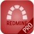
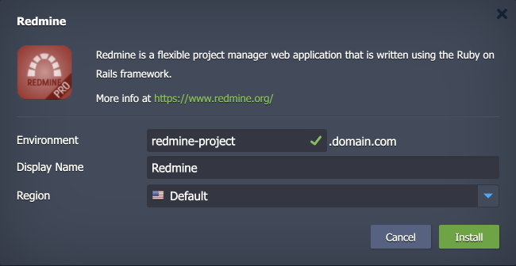

 

## Redmine

The package deploys the [Redmine](https://www.redmine.org/) solution - an open-source, cross-platform, and cross-database compatible project manager built using the Ruby on Rails framework.

## Environment Topology

This package creates a dedicated Redmine environment that contains one application server and one database container. It automatically deploys and sets the Redmine application. The automatic vertical scaling is enabled out of the box, and [horizontal scaling](https://www.virtuozzo.com/application-platform-docs/automatic-horizontal-scaling/) can be configured (if needed). The default software stacks utilized in the package are the following:

- NGINX Ruby application server (Ruby 3.2)
- MySQL 8 database
- Redmine 5.1.3

## Deployment to Cloud

To get your Redmine solution, click the "**Deploy to Cloud**" button below, specify your email address within the widget, choose one of the [Virtuozzo Public Cloud Providers](https://www.virtuozzo.com/application-platform-partners/), and confirm by clicking **Install**.

> If you already have a Virtuozzo Application Platform (VAP) account, you can deploy this solution from the [Marketplace](https://www.virtuozzo.com/application-platform-docs/marketplace/) or [import](https://www.virtuozzo.com/application-platform-docs/environment-import/) a manifest file from this repository.

## Installation Process

In the opened installation window at the VAP dashboard, provide a preferred environment and display names, choose a region (if available), and confirm the installation.

Your Redmine application will be automatically installed in a few minutes.
