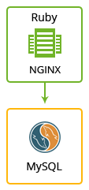

## Redmine

The JPS package deploys [Redmine](http://www.redmine.org/) that initially contains 1 application server and 1 database container.

### Highlights
This package is designed to deploy Redmine environment is a flexible project management web application. Written using the Ruby on Rails framework, it is cross-platform and cross-database. 
Some of the main features of Redmine are: 

- Multiple projects support
- Flexible role based access control
- Flexible issue tracking system
- Flexible issue tracking system
- Gantt chart and calendar
- News, documents & files management
- Feeds & email notifications
- Per project wiki
- Per project forums
- Time tracking
- Custom fields for issues, time-entries, projects and users
- SCM integration (SVN, CVS, Git, Mercurial, Bazaar and Darcs)
- Issue creation via email
- Multiple LDAP authentication support
- User self-registration support
- Multilanguage support
- Multiple databases support

### Environment Topology

### Specifics

Layer                |     Server    | Number of CTs   by default | Cloudlets per CT   (reserved/dynamic) | Options
-------------------- | --------------| :----------------------------: | :---------------------------------------: | :-----:
AS                   | NGINX RUBY |       1                        |           1 / 16                          | -
DB                   |    MySQL      |       1                        |           1 / 16                           | -

* AS - Application server 
* DB - Database 
* CT - Container

**Redmine Version**: 3.2.0.devel 
**Ruby Engine**: 2.0.0-p643 
**Ruby on Rails Engine**: 4.2.5 
**MySQL Database**: 5.6.29

### Deployment

In order to get this solution instantly deployed, click the "Get It Hosted Now" button, specify your email address within the widget, choose one of the [Jelastic Public Cloud providers](https://jelastic.cloud) and press Install.

To deploy this package to Jelastic Private Cloud, import [this JPS manifest](../../raw/master/manifest.jps) within your dashboard ([detailed instruction](https://docs.jelastic.com/environment-export-import#import)).

More information about Jelastic JPS package and about installation widget for your website can be found in the [Jelastic JPS Application Package](https://github.com/jelastic-jps/jpswiki/wiki/Jelastic-JPS-Application-Package) reference.
